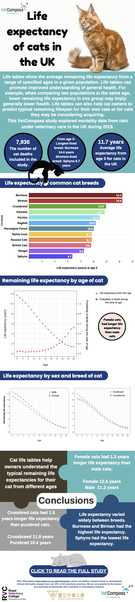

* [Cat life tables](#cat-life-tables)
* [Dog life tables](#dog-life-tables)
* [Dog breed-specific life tables](#dog-breed-specific-life-tables)

## Cat life tables

The paper: <a href="https://doi.org/10.1038/s41598-022-10341-6" target="_blank" rel="noopener noreferrer"> Life tables of annual life expectancy and risk factors for mortality in cats in the UK
</a> presents life tables of cats and cats of different sexes in the UK.

A life table can tell how long a cat is expected to live (i.e., life expectancy) at a certain age. 

  

## Dog life tables

**[NEW]** You can now see the recorded talk about UK dog life tables from Dr Kendy Teng at the ISVEE 2022 from <a href="https://u.pcloud.link/publink/show?code=XZsiKQVZlSjbxITVOK7UN4aBNIcDebf1YREX"> **HERE**</a> 

The paper: <a href="https://doi.org/10.1038/s41598-022-10341-6" target="_blank" rel="noopener noreferrer"> Life tables of annual life expectancy and mortality for companion dogs in the United Kingdom</a> presents life tables of dogs and different dog breeds in the UK.

A life table can tell how long a dog is expected to live (i.e., life expectancy) at a certain age. 

  

## Dog breed-specific life tables

We have made life tables for 18 dog breeds: **American Bulldog**, **Beagle**, **Border Collie**, **Boxer**, **Cavalier King Charles spaniel**, **Chihuahua**, **Cocker Spaniel**, **English Bulldog**, **French Bulldog**, **German Shepherd Dog**, **Husky**, **Jack Russell Terrier**, **Labrador Retriever**, **Pug**, **Shih-tzu**, **Springer Spaniel**, **Staffordshire Bull Terrier**, and **Yorkshire Terrier**.

Here you can download these <a href="dog-breed-specific-life-tables.pdf" target="_blank">dog breed-specific life tables</a>. 

The last column of each table contains informatoin about the life expectancy at specific age of the breed. 

