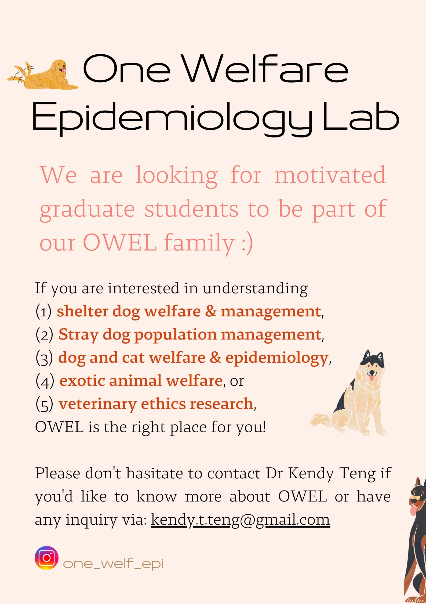

The OWEL is located at the <a href="http://www.vm.nchu.edu.tw/" target="_blank" rel="noopener noreferrer"> National Chung Hsing University</a> in Taiwan, led by Dr <a href="https://scholar.google.com/citations?user=FO4xM_oAAAAJ&hl=en/" target="_blank" rel="noopener noreferrer"> Kendy Tzu-yun Teng</a>.

Through applying **epidemiological methods**, the OWEL aims to improve both **animal and human welfare** (**One Welfare**). Currently, we focus on trying to understand and quantify the negative impact of real life **One Welfare** issues, such as stray and shelter animals issues, inherited diseases in companion dogs and cats, exotic pet welfare, and grief due to pet loss.

[[<i class="fa fa-envelope-o"></i>](mailto:kendy.t.teng@gmail.com){: .awe-ico }]
[[<i class="fa fa-instagram"></i>](https://www.instagram.com/one_welf_epi/){: .awe-ico }]

* [Publications](/publications/)        
* [Projects](/projects/)
* [Lab members](/members/)
* [Join us!](/join_us/)
* [Science communications](/communications/)
* [Kendy's personal site](/kendy/)

 
