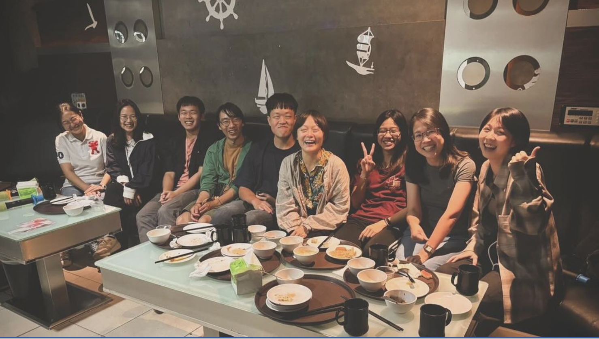 

## Principle Investigator
Teng, Kendy Tzu-yun 鄧紫云

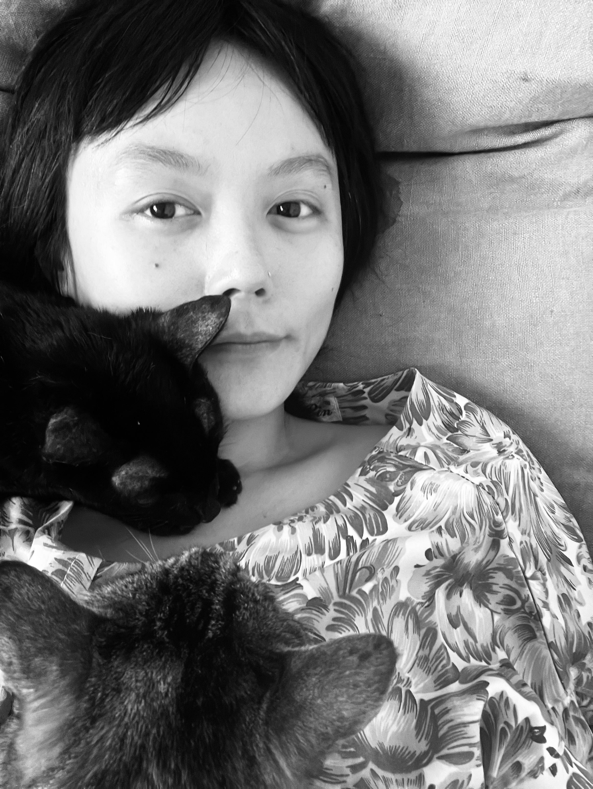 

## Lab Assistant

Chen, Huai-Enn 陳懷恩 

 

Chen, Yu-Hsin 陳妤欣 

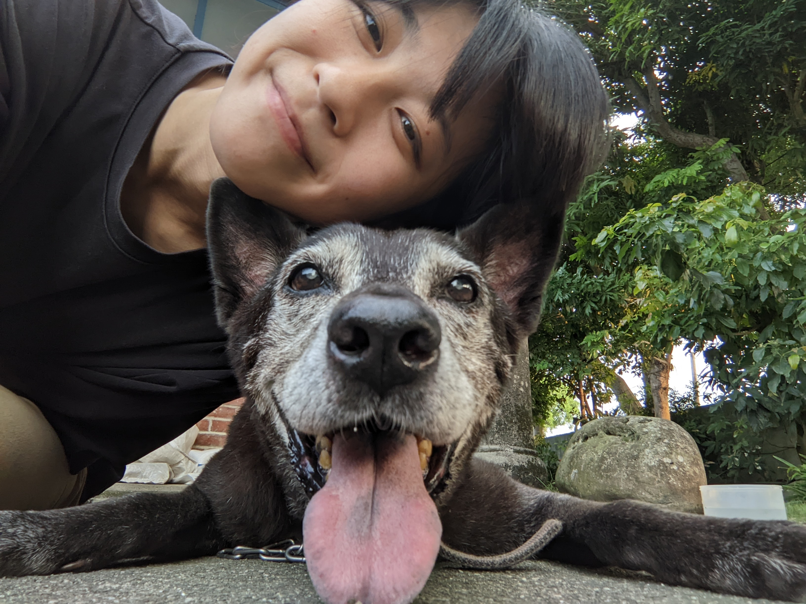 

Yeh, Hsiao-Mei 葉筱玫 

Mei-mei 妹妹 

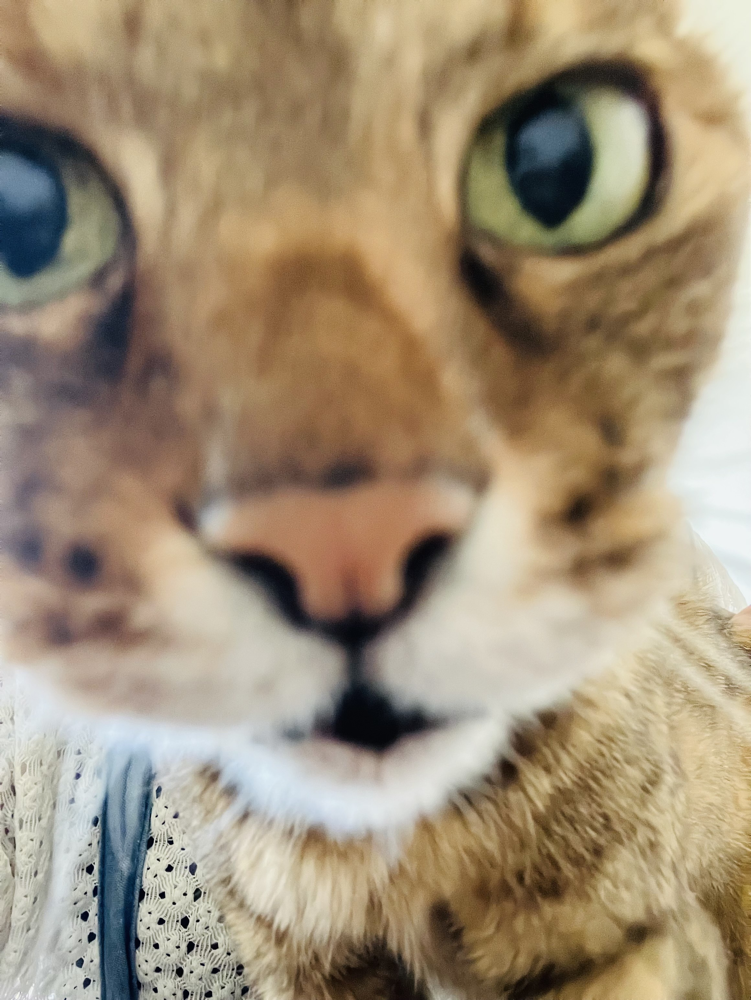 

## Undergrad Investigator 
Lin, Chen Yan 林辰晏 

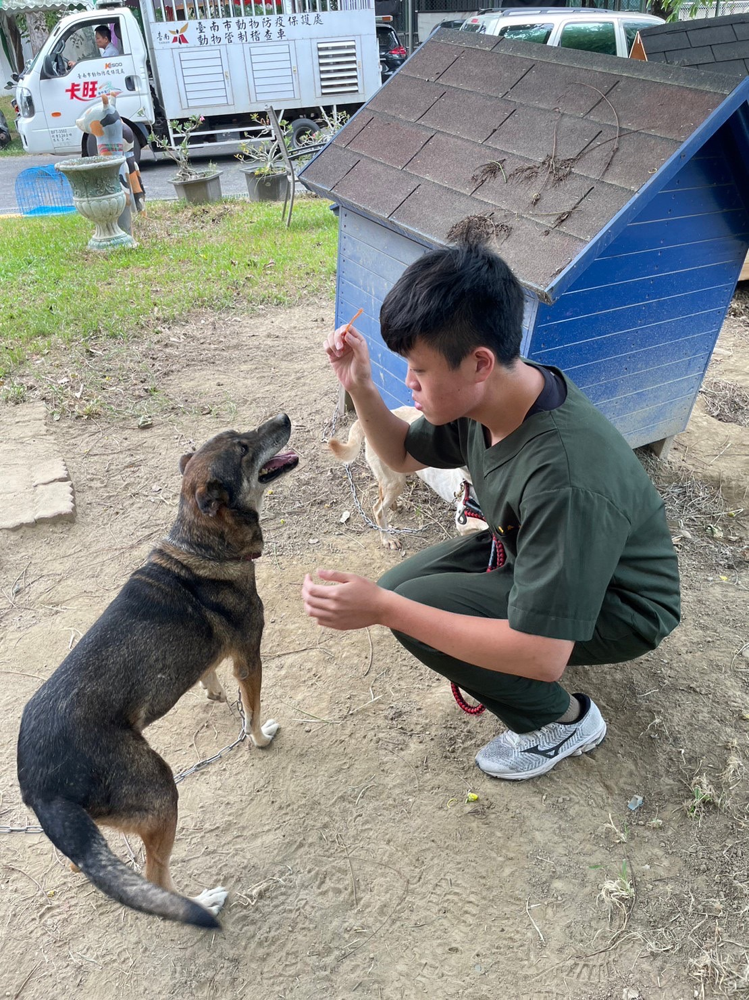 

温尚樺  

Chen, Ching Yi 陳靜怡 

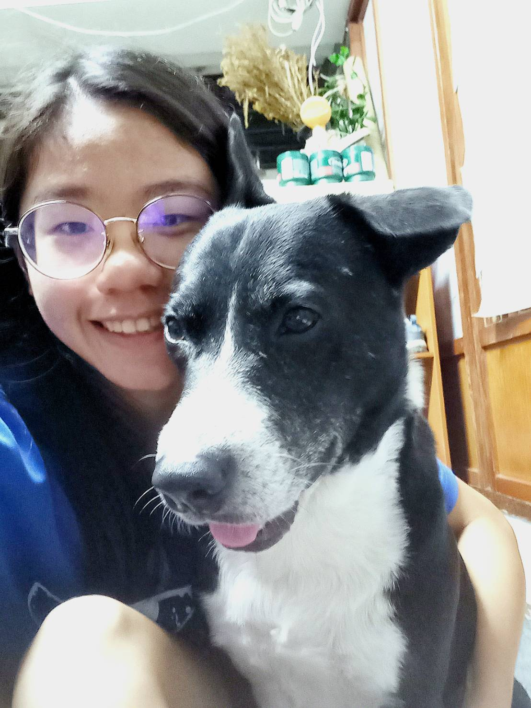 

Wu, Po-Ying 吳柏穎 

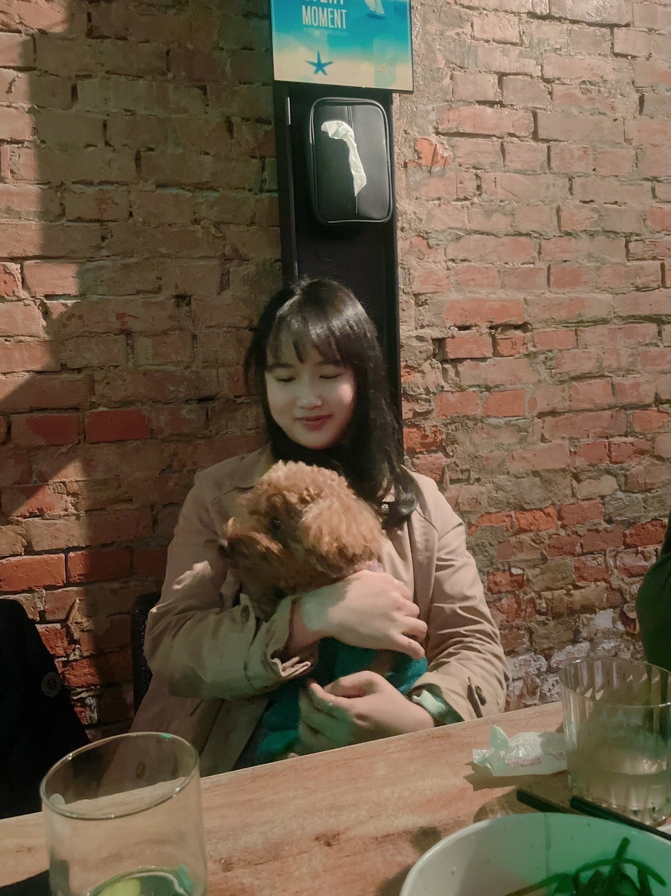 

林煒軒  

Wong, Tsz Ching 王梓澄  

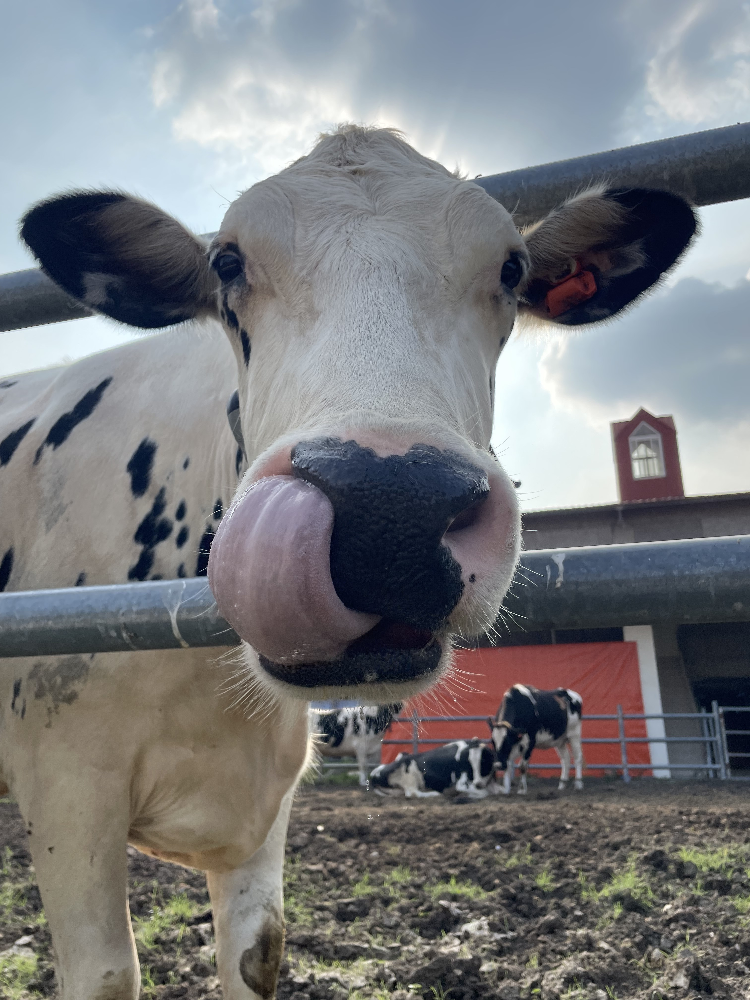 

## Previous Lab Members

Blackie 小黑 

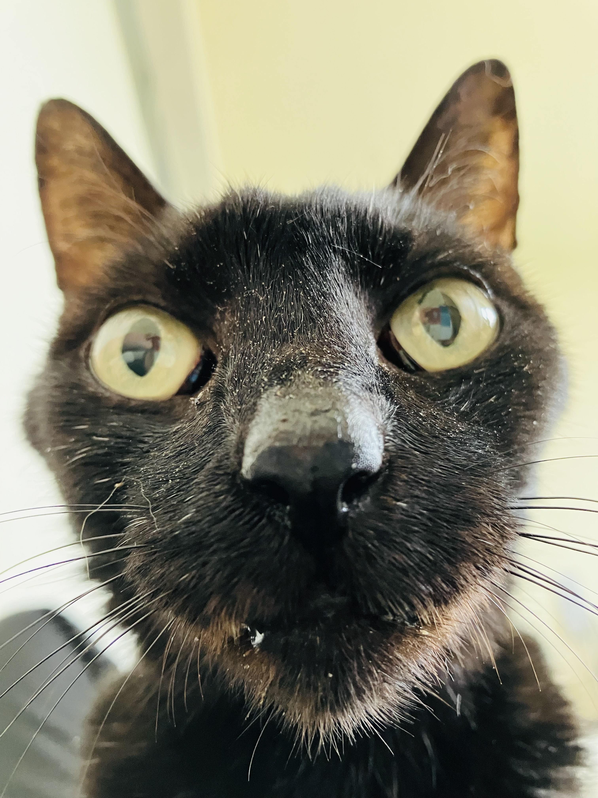 

Lin, Tsan-Ying 林粲英 

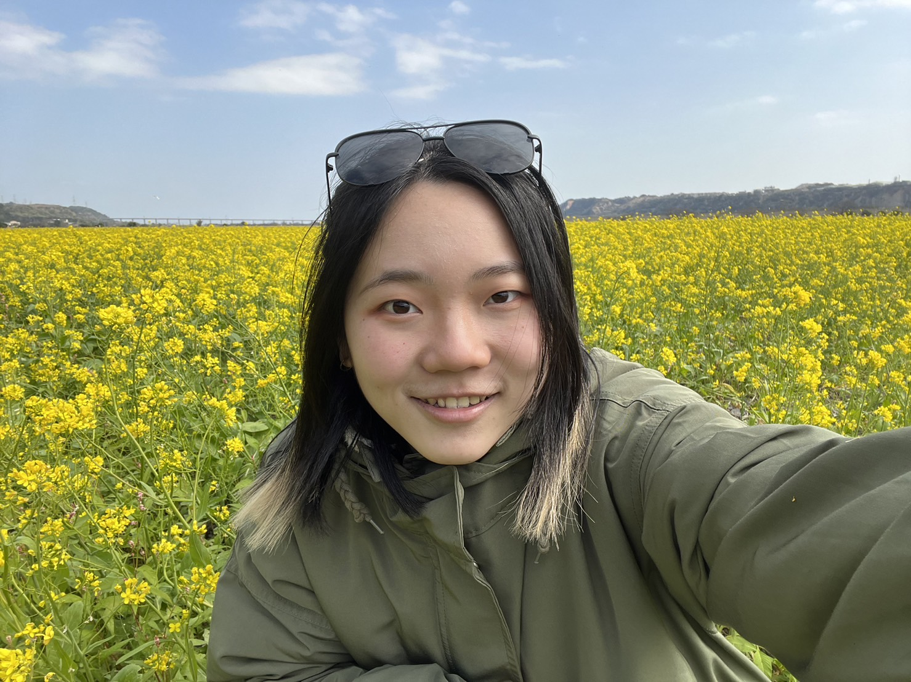 

Huang, Yan Rung (Chichi) 黃晏融 

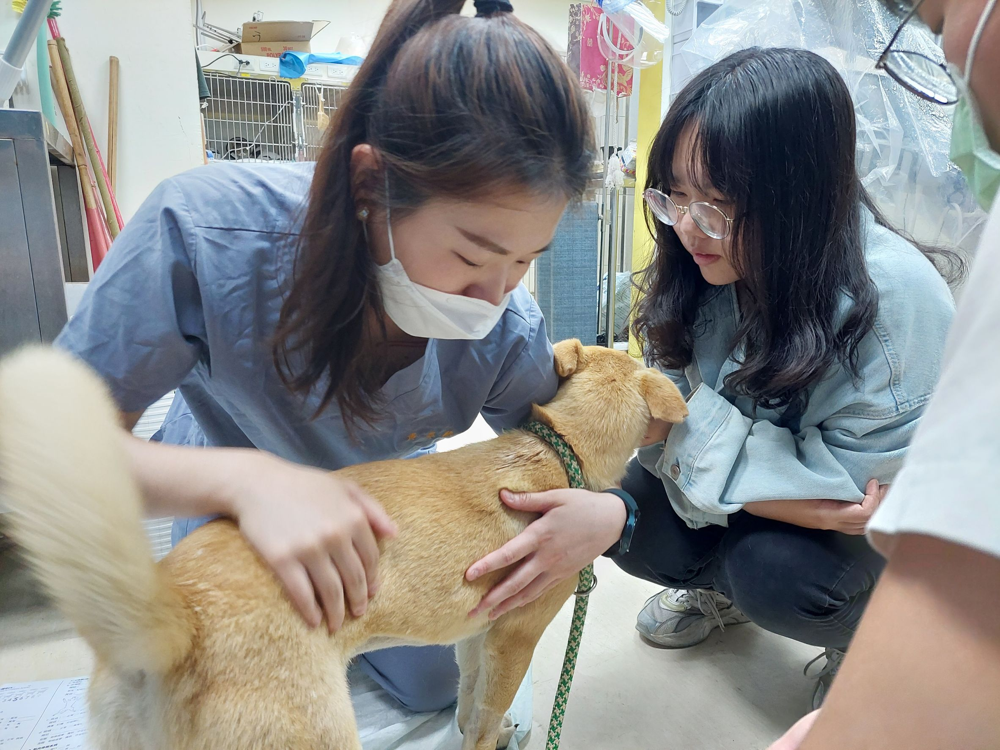 

Hsieh, Irene 謝宛真 

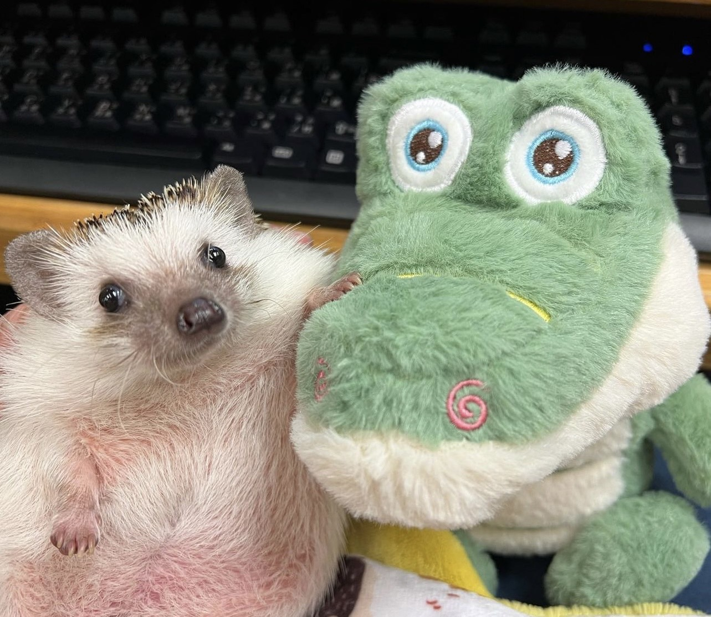 

  
